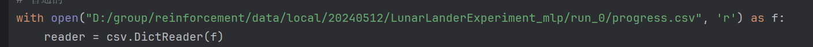

# 群对称与强化学习
python 3.9.19(anaconda)

MDPhttps://github.com/ElisevanderPol/mdp-homomorphic-networks

火星探测环境https://github.com/dimikout3/MarsExplorer

植物大战僵尸环境https://github.com/inf581-pvz-anonymous/pvz_rl

代码是在上述仓库的基础上修改的

## 环境
```
# gymnasium库是gym的新版本
pip install gymnasium[box2d]
# 然后缺啥库补啥就行
```
## 运行

直接在cmd里面输入这些指令，除了火星的需要单独用jupyter

```
# 月球登录
# 后面有个参数network里面是网络类型（等变和一般）
python lunarlander.py --run_ID 0 --network equivariant --lr 0.001 --fcs 64 64 
python lunarlander.py --run_ID 0 --network mlp --lr 0.0003 --fcs 64 64


# 火星
python carracing.py  --run_ID 0 --network equivariant --lr 0.00001
# 火星的普通版本需要单独运行footbook_mars_normal.ipynb


# pvz
python pvz_start.py --run_ID 0  --network equivariant --lr 0.0001 --fcs 512 512
python pvz_start.py --run_ID 0  --network mlp --lr 0.0001 --fcs 512 512
```


## 数据画图
月球的需在data/local下footbook_lunar.ipynb进行，在运行完成后会出现一个名字叫当天日期的文件夹，里面有个progress.csv，把读文件的两个操作改成这个文件路径即可，如下图，这是需要修改的路径



植物大战僵尸的在footbook_pvz.ipynb里面，其余同理

火星的对称网络的运行数据同理，普通的数据话在footbook_mars_normal.ipynb同级的txt文件里面，画图也在这个ipynb里面
(火星探测的数据在GridworldExperiment里面名字没改)